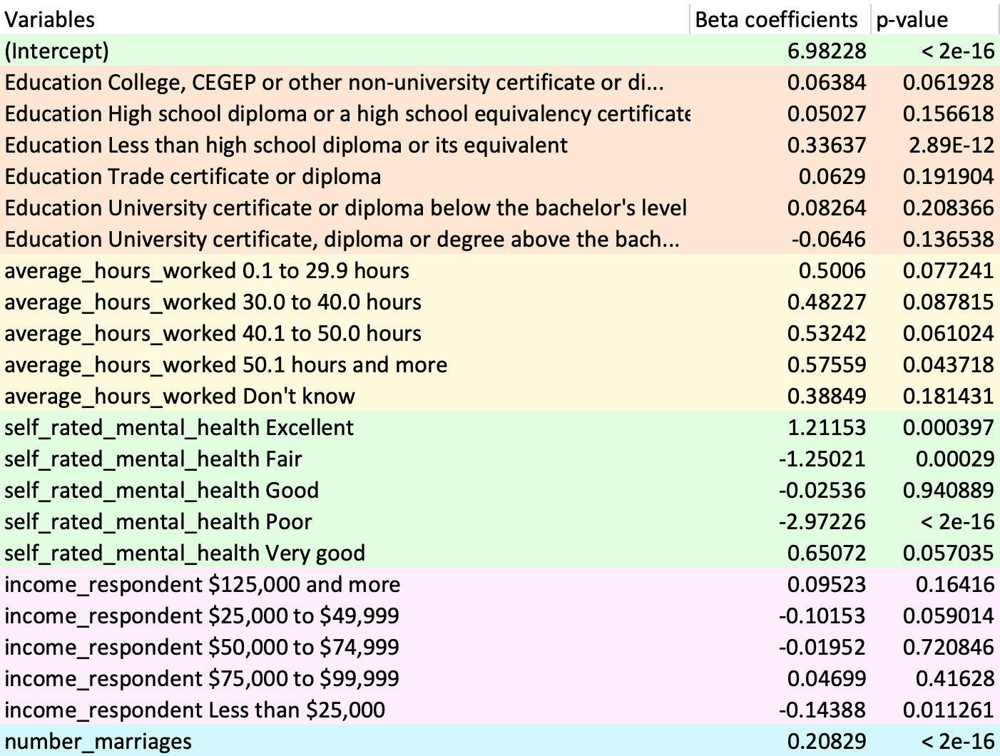

```{r, include=FALSE}
library(tidyverse)
library(survey)
library(gridExtra)
```


```{r, include=FALSE}
setwd('/Users/zishuzhu/Desktop/304/problemset2')
gss_data <- read.csv(file = 'gss2.csv')
head(gss_data)
gss_data<-na.omit(gss_data)
str(gss_data)
head(gss_data)
```

```{r, include=FALSE}
gss_data$education<-as.factor(gss_data$education)
gss_data$average_hours_worked<-as.factor(gss_data$average_hours_worked)
gss_data$self_rated_mental_health<-as.factor(gss_data$self_rated_mental_health)
gss_data$income_respondent<-as.factor(gss_data$income_respondent)

gss_data$education <- factor(gss_data$education, ordered = FALSE)
gss_data$average_hours_worked <- factor(gss_data$average_hours_worked, ordered = FALSE)
gss_data$self_rated_mental_health <- factor(gss_data$self_rated_mental_health, ordered = FALSE)
gss_data$income_respondent <- factor(gss_data$income_respondent, ordered = FALSE)
```

```{r, include=FALSE}
N=30633177
n=length(gss_data$feelings_life)
srs = rep(N, n)
srs_data <- svydesign(id=~1, data=gss_data, fpc=srs)
svy_srs <- svyglm(feelings_life ~ education+average_hours_worked+
                    self_rated_mental_health+income_respondent+number_marriages
                  , srs_data, family="gaussian")
```


```{r, include=FALSE}
summary.lm(svy_srs)
```


## Abstract

Nowadays, increased people start to think about how to make their lives happier, some people would suggest that making more money would make their lives better, while some people think that spending less time on working would make their lives more enjoyable, but there is no common correct answer to this question. In this report, we are interested in what factors would affect the feelings of life, how would things such as working hours, education, and income, making feelings of life different. We obtained a dataset of the general social survey in 2017, including the information of over 20000 subjects with information categories like feelings of life, education, mental health, etc. We use this dataset and built a linear regression model, found that education, self-rate mental health, income, and the number of marriages all have a positive or negative impact on feelings of life, and people, by using this model, would be able to figure out how to improve their feelings of life.


## Introduction

We are interested in what factors would affect people's feelings of life, and how these factors affect it. We obtained the data from the GSS program, a General social survey of families, to investigate our topic. More specifically, we are looking at how variables education, average hours of work, self-rated mental health, income, and the number of marriages would affect people's feelings of life. We built a linear regression model to predict feelings of life and this would help us to interpret how these factors impact feelings of life.


## Data

The dataset we obtained was made by the GSS program, who conducted the survey through telephone across 10 provinces in Canada, using a simple random selection without replacement. The dataset obtained information such as conjugal history, leaving the parental home, family origins, etc. All this information is collected to describe a family. The target population is all people who live in Canada and elder than 15 years old, and the frame is combined by two parts: the telephone number that is in use and the address register, in this way, the address would be associated with a valid number that is currently used. The sample is people who live in 10 provinces in Canada and got randomly selected, surveyed by telephone, and information was collected from people who answered the calls and willing to take the survey. The sampling method is good because when GSS doing the survey, each province has a minimum requirement of responses, once the requirement of the number of responses is met, the remaining responses were collected equally from different provinces, so the data was equally collected from different provinces and there would be no bias between provinces. The total number of variables is 6, we only remained the variables that are related to our interests. The dataset is good because we have many data across entire Canada with many categorical variables providing information, and we only chose the information that is related to our topic so the analysis would not be too difficult. However, this is only the data in Canada, if people are looking for answers in North America or global areas, the model we built based on this data is not helping.


## Model

We build a multiple linear regression model to predict feelings of life based on their education, averaged hours worked per week, self-rated mental health, income respondent, and the number of marriages. The reason for choosing those explanatory variables is because we think those are the elements that might affect Canadians feelings of their lives. We use numerical variable $number\_marriages$ to represent how many times the person has married. We use categorical variables $education$, $average\_hours\_worked$, $self\_rated\_mental\_health$, and $income\_respondent$ to represents the highest level of education that the person has completed, average hours the person works per week, mental health condition rated by the person him/herself, and his/her annual income, respectively. By the observed data, we have fitted a linear equation as follow:$$feelings\_life = \hat{\beta_{0}} + \hat{\beta_{1}}\cdot education(College, CEGEP...)...+\hat{\beta_{22}}\cdot number\_marriages$$

We use R to run this model. From figure 1, we can see that there are 22 beta coefficients in the equation. These coefficients can measure the association between explanatory variables and outcomes. And we can test the significance of each coefficient in the linear equation by t-test for each $\hat{\beta_{i}}$ corresponding to each predictor variable. For variables $\hat{\beta_{1}}$ to $\hat{\beta_{22}}$, they are dummy variables, for example, if the observation has college education, the $\hat{\beta_{1}}$ for this observation is 1, otherwise $\hat{\beta_{1}}$ is 0. Similar logic can be applied to all dummy variables. We can see the p-values associated with each predictor variable under the t-test.

```{r, echo=FALSE, out.width="80%", fig.cap="Model Summary Table 1"}

```


```{r, echo=FALSE, out.width="55%", fig.cap="Model Summary Table 2"}
knitr::include_graphics("Screen Shot 2020-10-19 at 10.53.01.jpeg")
```


From the figure 2, we could see the following information. In this model $R^2$(Multiple R-squared) is 0.2553, and this represents the 0.2553 of the variance of feelings of life explained by the explanatory variables in this model and we think this is quite high for real-life data. And R is square root of $R^2$. Then we can look at the F test to test the entire model. F-test can test multiple coefficients simultaneously. F-test compares the model with the intercept-only model. From the table, we can see that the F statistic is 204.7 and the p-value for F-test is < 2e-16. Thus, the parameter is significant, and we should reject the null hypothesis that the true model is intercept-only.  


Now we can look at the performance of each predictor variable. We should note that in our model we have converted all the categorical variables to dummy variables. 

By looking at figure 1, we can get the following information. For variable categorical $education$, we have 7 levels, so we have 6 dummy variables, and the base case is $Bachelor's$ $degree$. And $\hat{\beta_{i}}$ here can tell the amount of change in $feelings\_life$ when an individual is another level of education versus a bachelor's degree. And look at all the $\hat{\beta}$ coefficients for each level of education, we can conclude that education can affect people's feeling of life. From the table above, we can see that people with "Less than high school diploma or its equivalent" with $\hat{\beta_{3}}=0.33637$ have a highly significant p-value which is 8.86e-11. This means that people with Less than a high school diploma or its equivalent score is 0.33637 higher than people with a bachelor's degree.

For categorical variable $average\_hours\_worked$, we have 6 levels, so we have 5 dummy variables and the base case is  $0$ $hour$. And$\hat{\beta_{i}}$ here can tell the amount of change in $feelings\_life$ when individual works larger than 0 hours per week versus 0 hours. And there is no highly significant p-value in this category, so we can summarize that average worked hours per week will not affect people's feelings of life.

For categorical variable $self\_rated\_mental\_health$, we have 6 levels, so we have 5 dummy variables, and the base case is $don't$ $know$. And $\hat{\beta_{i}}$ here can tell the amount of change in $feelings\_life$ when an individual knows how to rate their mental health than don't know. To sum up, self-rated mental health can affect people's feelings of life. From the table above, we can see that people with "Poor" self-rated mental health with $\hat{\beta_{15}}= -2.97226$ have a highly significant p-value which is < 2e-16. These means that people with poor self-rated mental health's score is -2.97226 lower than people who don't know how to rate their mental health.

For categorical variable $income\_respondent$, we have 6 levels, so we have 5 dummy variables, and the base case is $\$$$100,000$ to $\$$$124,999$. And$\hat{\beta_{i}}$ here can tell us the amount of change in $feelings\_life$ when individual earn money other than $\$100,000$ to $\$124,999$ versus people earn exactly $\$ 100,000$ to $\$124,999$. To conclude, income of respondent can affect people's feelings of life. From the table above, we can see that people with the income "Less than $\$25,000$" per year with $\hat{\beta_{21}}= -0.14388$ has a highly significant p-value which is 0.011261. This means that people with a yearly income of less than $\$25,000$ are -0.14388 lower than people who earn exactly $\$100,000$ to $\$124,999$.

For variable numerical $number\_marriages$ with $\hat{\beta_{22}}=0.20829$ has highly significant p-value which is < 2e-16. This means that every time number of marriages increased by 1, an individual's feelings of life score will increase by 0.20829. Thus, the number of marriages has a positive effect on people's feelings of life.


## Results


```{r, echo=FALSE}
# Create Data
w <- nrow(subset(gss_data, self_rated_mental_health=="Don't know"))
y <- nrow(subset(gss_data, self_rated_mental_health=="Excellent"))
q <- nrow(subset(gss_data, self_rated_mental_health=="Fair"))
v <- nrow(subset(gss_data, self_rated_mental_health=="Good"))
r <- nrow(subset(gss_data, self_rated_mental_health=="Poor"))
x <- nrow(subset(gss_data, self_rated_mental_health=="Very good"))
pie_data <- data.frame(
  mental.health=levels(gss_data$self_rated_mental_health), #"Don't know" "Excellent"  "Fair"       "Good"       "Poor"       "Very good" 
  value=c(w,y,q,v,r,x)
)

# Basic piechart
graph2 <- ggplot(pie_data, aes(x="", y=value, fill=mental.health)) +
  geom_bar(stat="identity", width=1) +
  coord_polar("y", start=0)+
  theme_void()+
  ggtitle("Figure 3: Pie chart Self-rated Mental Health")
graph2
```


We can conclude the following result. The factors that have an impact on individuals' feelings of life are education, self-rated mental health, yearly income, and the number of marriages. The factor that will not affect people's feelings of life is average worked hours. By looking at the average feelings of life per education category, we could see that people with lower-level education feels better in their lives than those people who have higher education. By the mean feelings of life per self-rate mental health category, we can tell that people with mental health issues feel worse in life than those who don't. Looking at the average feelings of life per respondent income category, people with lower yearly income have lower satisfaction with their life.

The mean score of feelings of life in our sample is 8.125266. We can tell that base on the sample data, most Canadian people aged 15 and older feelings satisfied with their life. We build a pie chart(figure 3) to divide the categorical variable "self-rated mental health" into separate levels to show which levels make up the whole. From the pie chart for mental health, a large proportion of people have a good or very good or excellent self-rated mental health. We are excited to see that most people are in good mental health conditions.

And taking a glance at the histogram in Figure 4, we could conclude that although the model tells us that people's average feelings of life will increase when their number of marriages is increasing, most of the married people have only married once. Therefore, we don't have enough evidence to inform that feelings of life are proportional to the number of marriages. We can only conclude from the model that people who are married have a better feeling of life than those who never married.

```{r, echo = FALSE}
hist.plot <- ggplot(gss_data, aes(x = number_marriages, y = ..count..))+
  geom_histogram(binwidth = 1, color = "white", fill="blue")+
  labs(x = "number of marriages", y = "Count", title = "Histogram of number of marriages")+
  ggtitle("Figure 4: Histogram for Number of Marriages")
#Histogram help to see the distribution of random variable Forearm Length
hist.plot
```


## Discussion

The survey was conducted by GSS program, who surveyed people who is elder than 15 years old and living in Canada, mainly collected the information such as conjugal history, leaving the parental home, family origins, etc. This model can provide a reference to those people who are looking for reasons why they feel happy or unhappy in their life. Using this model, individuals can also figure out the social phenomenon about feelings of life, such as some places have a higher suicide rate or people who live in certain places live longer. What's more important is that people can use this model to improve their feelings of life, by looking at the model people would know how each variable has a positive or negative effect on feelings of life. Meanwhile, Life satisfaction is linked to many beneficial outcomes. If people feel good about their lives, they will have a better social relationship and a better chance to achieve success in the workplace and school. This model also can represent Canadian people aged 15 and above’s overall life satisfaction. For individuals, people who are struggling with feelings of life would be helped from this model, they would figure out what they can do to improve their mood. For organizations, such as government or organizations that try to help people out, they can use this model to help people.


# Weaknesses

This data was collected from February 2 to November 30, 2017. One of the weaknesses is that the data did not consider seasonal effects. Within the winter months, the onset of depression would affect people's feelings of life.

The economic growth of Canada was higher in 2017 compared with former years, which attributed to the reviving oil industry. Cheaper gas prices and overall higher-income stimulated Canadians' satisfaction towards life. Which means this survey should be considered as taken from a more optimistic side since the same economic growth cannot be sustained every year. Therefore, to improve the objectivity and integrity of the data from the target population, the results of years close to 2017 should also be taken into consideration.

Moreover, the data only includes individuals 15 years of age and older in Canada. Thus, it would be insufficient to represent non-Canadian citizens based on the data we had analyzed in this study.


# Next Steps


As we discussed before, one of the weaknesses is that data were collected from February to November, so data from Winter is missing, if the season is one of the factors that can affect feelings of life, the bias would exist. Therefore, for the next step, we are planning to conduct another survey, with the same sampling strategy, collect data from January 1st to December 31st. In this way, there should be less bias exist due to seasonal influence. On the other hand, considering the difference between different years, the survey we talked about before will also help to eliminate bias made by the difference of years.

Meanwhile, we want to expand our scope, by adding more variables and studying them. The current factors are not sufficient for us to study on our topic. We want to start building a model with more variables, then remove variables during the process of building. In this way, more variables would be put into our consideration and the final model may still have a clean, 5-6 variables model.

## References

$\bullet$ Wickham et al., (2019). Welcome to the tidyverse. Journal of Open Source Software, 4(43), 1686, https://doi.org/10.21105/joss.01686
 
$\bullet$ T. Lumley (2020) "survey: analysis of complex survey samples". R package version 4.0.

$\bullet$ T. Lumley (2004) Analysis of complex survey samples. Journal of Statistical Software9(1): 1-19

$\bullet$ T. Lumley (2010) Complex Surveys: A Guide to Analysis Using R. John Wiley and Sons.

$\bullet$ Baptiste Auguie (2017). gridExtra: Miscellaneous Functions for "Grid" Graphics. R package version 2.3. https://CRAN.R-project.org/package=gridExtra


## Link to GitHub for code and data supporting the analysis: 

https://github.com/Zishu111/problemset2


